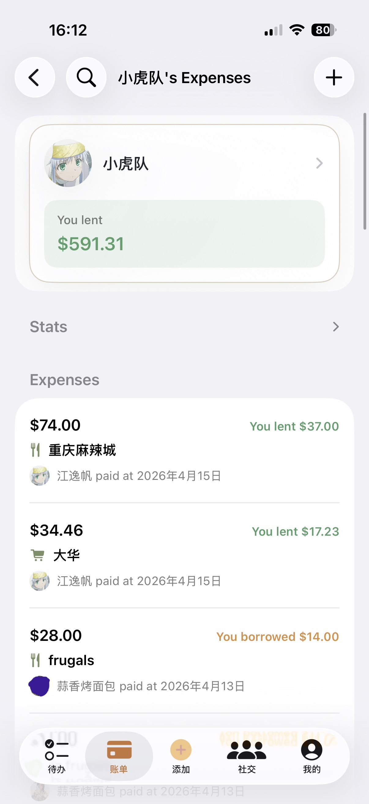
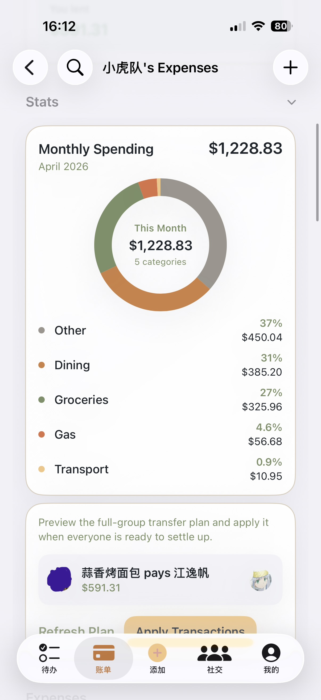
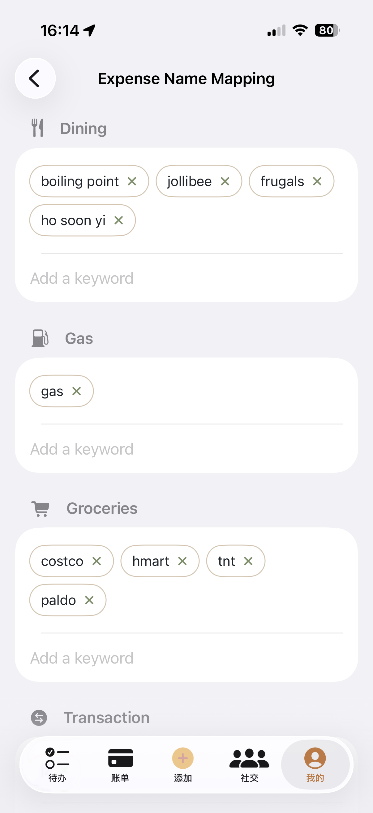
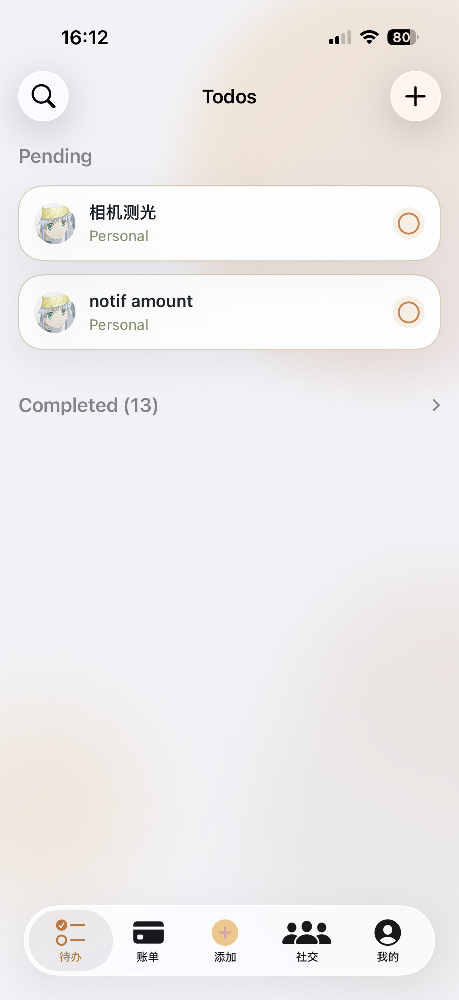

# CoLiz

**CoLiz** (Collaborative List) is a comprehensive group management, expense-splitting, and shared to-do list application. Whether you are managing household bills, planning a trip, or just keeping track of shared tasks with friends, CoLiz helps you keep everything organized and synchronized in real-time.

---

## 🛠️ Tech Stack

### Frontend
- **Platform:** Native iOS
- **Language/Framework:** Swift, SwiftUI
- **Architecture:** MVVM Design Pattern

### Backend
- **Language/Framework:** Go (Golang)
- **Database:** MySQL 8.0
- **Cache & Queue:** Redis 7
- **Deployment:** Docker & Docker Compose
- **Interface:** RESTful API specified by OpenAPI 3.1 (`api.yaml`)

---

## 📱 Frontend Overview

The frontend is a beautifully designed, fully native iOS application located in the `CoLiz/` directory (`CoLiz.xcodeproj`). Built entirely with modern **SwiftUI**, it seamlessly interacts with the Go backend to present real-time syncing of group data.

**Key Features:**

- **Expense Tracking:** Log shared expenses and easily settle up with friends. Supports equal, percentage, and exact-amount splits.
- **Balance Dashboards:** Instantly see who owes whom with automatic debt-simplification features.
- **Shared To-Do Lists:** Keep track of group chores, shopping lists, or trip itineraries.
- **User Management:** Robust profile setups, avatars, and friend request handling.

<p align="center">
  
  
  
  
</p>

---

## ⚙️ Backend Architecture & Structure

The backend is built using **Go** and designed around a clean, domain-driven architecture to handle high-concurrency expense splitting accurately.

### Directory Structure

```text
backend/
├── cmd/
│   ├── api/          ← Main HTTP API server entrypoint
│   └── worker/       ← Async background job consumer (e.g., email notifications)
├── internal/
│   ├── app/         
│   ├── config/       ← Environment variable definitions and config loading
│   ├── domain/       ← Core domain interfaces and entity definitions
│   ├── dto/          ← Data Transfer Objects mapped to OpenAPI specs
│   ├── http/         ← HTTP routing, middleware, and controllers
│   ├── infra/        ← Infrastructure clients (MySQL, Redis, Sendgrid/Resend)
│   ├── policy/       ← Authorization policies and rule engines
│   ├── repo/         ← Data access layer (MySQL queries)
│   ├── service/      ← Core business logic and orchestration
│   └── util/         ← Shared helpers (encryption, formats, etc.)
├── scripts/          ← Operational scripts (deployment, secret rotation)
├── sql/              ← Database table schemas and migration files
├── storage/          ← Persistent volume mounts (Avatars, MySQL/Redis data)
├── Dockerfile        ← Multi-stage build configurations
└── docker-compose.yml← Stack orchestration
```

- **OpenAPI Driven:** The `api.yaml` file at the root defines the strict contract between the iOS App and the Go backend services.
- **Operations:** For detailed deployment instructions, container management, and database configs, refer to the [Backend Quick Reference](./backend/README.md).

---

## 👨‍💻 Contributor

- **Developer:** brojyf
- **Email:** [brojy@163.com](mailto:brojy@163.com)

If you have any questions, feedback, or need support with CoLiz, feel free to reach out via email!
